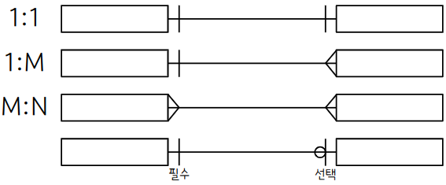
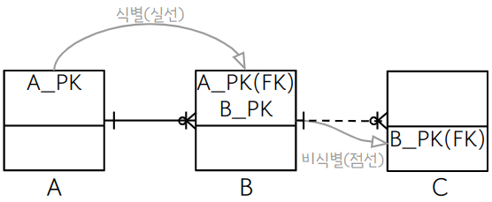
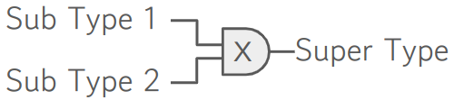
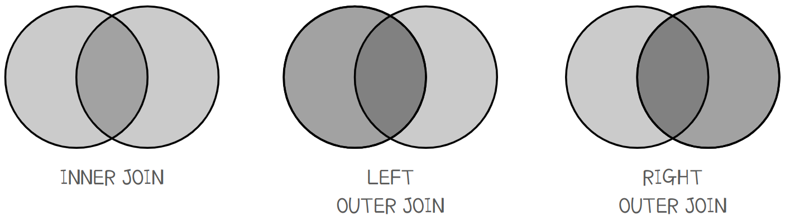
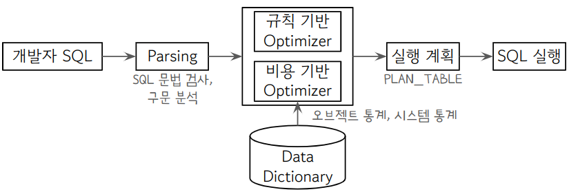
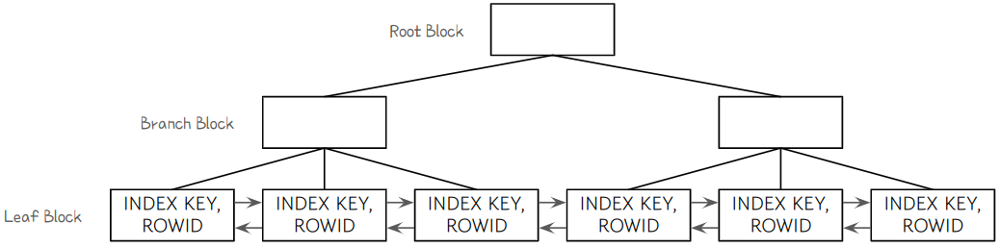
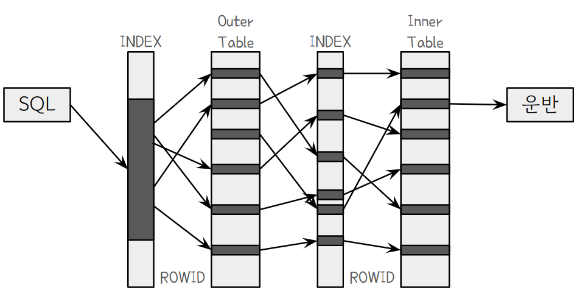
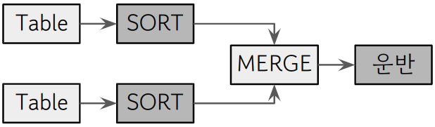

# SQL Developer

# 데이터 모델링의 이해

## 데이터 모델링의 이해

### ERD 작성 절차

1. 엔터티를 도출하고 그린다.
2. 엔터티를 배치한다.
3. 엔터티 간 관계를 설정한다.
4. 관계명을 서술한다.
5. 관계 참여도를 표현한다.
6. 관계의 필수 여부를 표현한다.

### 3층 스키마

데이터베이스를 3가지 관점에서 기술한다.


### 엔터티

: 업무에서 관리되는 집합

- **특징**
    1. 유일한 **식별자**가 있다.
    2. 2개 이상의 **인스턴스**가 있다.
    3. **속성**이 있다.
    4. 다른 Entity와 1개 이상의 **관계**가 있다.
- **종류**

1. **물리적 형태**의 존재 여부에 따라
    - **유형 E** : 물리적 형태 有
    (고객, 강사, 사원, …)
    - **개념 E** : 무형 (거래소 종목, 보험 상품)
    - **사건 E** : 프로세스 중 생성되는 E
    (주문, 체결)

1. **발생시점**에 따라 
    - **기본 E** : 독립적으로 생성
    (고객, 상품, 부서)
    - **중심 E** : 기본 E로부터 발생, 행위 E 생성 (계좌, 주문)
    - **행위 E** : 2개 이상의 E로부터 발생
    (주문 이력, 체결 이력)

### 속성

- **특징**
    
    - 일반적으로 하나의 값만 갖는다.
    - 기본키에 종속된다.
    
- **종류**

1. **분해 여부**에 따라
    - **단일** : 하나의 의미로 구성 (이름, ID, …)
    - **복합** : 여러 개의 **의미**로 구성
    (주소, 날짜, …)
    - **다중값** : 여러 개의 **값**을 갖는다.
    (상품리스트, …)

1. **특성**에 따라
- **기본** : 본래의 속성 (이름, 계좌, …)
- **설계** : 설계 과정에서 발생
(상품 코드, 지점 코드, …)
- **파생** : 다른 속성에서 파생
(평균, 합계, …)

### 관계

: 엔터티 간의 관련성

존재 관계 : 엔터티 간의 상태
행위 관계 : 엔터티 간에 행위가 있는 것

- **관계 차수**



- **식별 / 비식별 관계**



### 엔터티 식별자

- **기본키(=주식별자)의 특징** 🌟
최소성, 대표성, 유일성, 불변성
- **키의 종류**
기본키 : 후보키 중 엔터티를 대표하는 키
후보키 : 유일성과 최소성 만족
슈퍼키 : 유일성은 만족하지만 최소성은 만족하지 않음
대체키 : 후보키 중 기본키가 아닌 키
외래키 : 다른 테이블의 기본키 참조, 참조 무결성 용도

## 데이터 모델과 성능

### 정규화

- 목적 : 데이터의 일관성, 중복 최소화, 유연성 최대화
- 절차
    1. **제 1 정규화**
    속성의 원자성 확보, 기본키 설정
    2. **제 2 정규화**
    부분함수 종속성 제거
    3. **제 3 정규화**
    이행함수 종속성 제거
    4. **BCNF**
    후보키가 기본키를 종속시키면 제거
    5. **제 4 정규화**
    다중값 종속성 제거
    6. **제 5 정규화**
    조인 종속성 제거
- 문제점 : 조회시 Join 유발 ⇒ 시스템 자원 사용량 ▲

### 반정규화 기법

1. **계산된 칼럼 추가**
2. **테이블 수직 분할**
3. **테이블 수평 분할**
    
    **- 파티션 기법**
    
    : 하나의 테이블을 여러 개의 파일에 나누어 저장하는 방법.
      액세스 범위가 줄어 조회 성능 ⇒, 입출력 성능 ▲, 독립적 백업 복구 可
    
    - Range : 데이터 값의 범위 기준
    - List : 특정한 값 지정
    - Hash : 해시함수 적용
    - Composite : Range + Hash
4. **테이블 병합**
    
    
    
    | 변환방법 | 테이블 수 | 조인 | 관리 |
    | --- | --- | --- | --- |
    | One To One | 多 | 多 | 어려움 |
    | Plus | 多 | 多 | 어려움 |
    | Single | 1 | 少 | 쉬움 but, I/O  성능 ▼ |

# SQL 기본 및 활용

## SQL 기본

### SQL 종류

| 종류 | 설명 | 명령어 |
| --- | --- | --- |
| DDL | 데이터 정의 언어 | Create, Alter, Drop, Rename, Truncate |
| DML | 데이터 조작 언어 | Insert, Update, Delete, Select |
| DCL | 데이터 제어 언어 | Grant, Revoke |
| TCL | 트랜잭션 제어 언어 | Commit, Rollback, SavePoint |

### 트랜잭션

DB의 작업을 처리하는 단위

**원자성(Atomicity)**, **일관성(Consistency)**, **고립성(isolation)**, **영속성(Durability)**의 특성을 가진다.

### DDL - 테이블 생성

```sql
Create Table 테이블명
(
	칼럼명 데이터_타입 [제약조건],

	-- 기본키 지정하기 하나. --
	기본키 데이터_타입 primary key,
  -- 기본키 지정하기 둘. --
	Constraint 기본키_이름 primary key (기본키1[, 기본키2[, ...]]),
	-- 외래키 지정하기 --
	Constraint 외래키_이름 foreign key (자식_칼럼)
		references 부모_테이블(부모_칼럼)
		/* 외래키 cascade 설정하기 (부모 칼럼의 delete 또는 update 상황에 종속) */
		on delete cascade on update cascade
	-- 기본값 지정하기 --
	칼럼명 데이터_타입 default 기본값,
	-- null 제한하기 --
	칼럼명 데이터_타입 not null,
	...
);
```

### DDL - 테이블 변경

```sql
-- 테이블명 변경 --
Alter Table 테이블명 rename to 새로운 테이블명;
-- 칼럼 추가 --
Alter Table 테이블명 add (칼럼명 데이터_타입 [제약조건]);
-- 칼럼 변경 --
Alter Table 테이블명 modify (칼럼명 데이터_타입 [제약조건]);
-- 칼럼 삭제 --
Alter Table 테이블명 drop column 칼럼명;
-- 칼럼명 변경 --
Alter Table 테이블명 rename column 칼럼명 to 새로운_칼럼명; 
```

### DDL - 테이블 삭제

`Drop Table [테이블명];` ⇒ 테이블의 데이터와 구조 모두 삭제

`Drop Table [테이블명] cascade constraint;`  ⇒ 해당 테이블을 참조한 자식테이블의 제약사항 삭제

`Truncate Table [테이블명];`  ⇒ 테이블의 구조는 남기고 데이터를 모두 삭제 (테이블 용량 초기화)

### 뷰(View)

테이블로부터 유도된 가상의 테이블

- **특징**
    1. 참조한 테이블이 변경되면 뷰도 변경
    2. 입력, 수정, 삭제 제한
    3. 보안성 향상
    4. 데이터 관리, Select문이 간단
    5. 독자적 인덱스 생성 불가

```sql
-- 생성 --
Create View 뷰_이름 as Select 조회할_칼럼들 from 테이블명;
-- 조회 --
Select 조회할_칼럼들 from 뷰_이름;
-- 삭제 --
Drop View 뷰_이름;
```

### DML - Insert

```sql
-- INSERT문 --
Insert into 테이블명(칼럼1, 칼럼2, ...) values(데이터1, 데이터2, ...);
/*
- 순서대로 칼럼과 데이터가 매핑된다.
- 문자열을 입력할 때는 작은 따옴표를 사용한다.
- 모든 칼럼에 데이터를 입력할 때는 칼럼명을 생략한다.
	Insert into 테이블명 values(데이터1, 데이터2, …)
*/
-- SELECT문으로 입력 --
Insert into 테이블명 Select 칼럼명 from 테이블명
/* 후행 테이블의 칼럼을 조회해서 선행 테이블에 입력 */
-- Nologging --
Alter Table 테이블명 Nologging;
/* 데이터 입력 시 발생하는 로그를 남기지 않음으로 입력 성능 향상 */
```

### DML - Update

`Update 테이블명 set 칼럼명 = 데이터 where 조건` 

(조건에 해당하는 데이터 모두 수정한다.)

### DML - Delete

`Delete from 테이블명 where 조건` 

(조건에 해당하는 데이터 모두 삭제한다. 삭제한다고 해서 용량이 줄어들지 않는다.)

### DML - Select

```sql
Select 칼럼명1, 칼럼명2, ... from 테이블명
/*
	asterisk(*) => 해당 테이블의 모든 칼럼
	칼럼명 || '문자' => '칼럼 문자'의 형태로 출력
	`이름 as 별칭` 또는 `이름 별칭` => 칼럼명이나 테이블명을 `별칭`으로 출력할 수 있다.
	Select Distinct 칼럼명 => 해당 칼럼명이 중복되지 않게 출력한다.
*/
Where [조건]
/* 조건에 해당하는 모든 행 조회 */
Order by 칼럼명1 [asc/desc], 칼럼명2 [asc/desc], ...;
/*
	asc/desc를 생략하면 기본 오름차순으로 정렬
	정렬 연산은 DB에 부하를 준다. 인덱스를 활용해 정렬을 회피할 수 있다.
	인덱스는 기본적으로 기본키의 오름차순으로 생성된다.
	지정하고 싶다면 "Select /*+ INDEX_[ASC/DESC](칼럼명) */ from 테이블"와 같이 표현한다.
*/
```

### DML - Select - Where문

| 연산자 | 설명 | 연산자 | 설명 |
| --- | --- | --- | --- |
| =  | 일치 | OR  | 논리합 |
| <  | 미만 | NOT  | 부정 |
| <=, NOT 칼럼명 >  | 이하 | LIKE '비교 문자열'  | 문자열 비교 연산자 |
| >  | 초과 | BETWEEN A AND B  | A와 B 사이 여부 반환 |
| >=, NOT 칼럼명 <  | 이상 | IN (list)  | list에 해당 값 존재 여부 반환 |
| !=, ^=, <>, NOT 칼럼명 =  | 불일치 | IS NULL  | NULL 여부 반환 |
| AND  | 논리곱 |  |  |

IN 예시 : `Select * from EMP Where (DEPT, NAME) IN (('sale', 'john' ), ('account', 'david'))` 

| 와일드카드 | 설명 | 예시 |
| --- | --- | --- |
| % | 모든 문자 | 'A%'  ⇒ ‘A’로 시작하는 모든 문자 |
| _ | 단일 문자 | 'A_' ⇒ ‘A’ 뒤에 한 글자만 더 있는 문자 |

| NULL 함수 | 설명 |
| --- | --- |
| NVL(칼럼명, exp) | 칼럼 값이 Null이면 exp로 바꾼다 |
| NVL2(칼럼명, exp1, exp2) | 칼럼 값이 Null이 아니면 exp1, Null이면 exp2 반환 |
| NULLIF(exp1, exp2) | exp1와 exp2가 같으면 Null 반환 다르면 exp1 반환 |
| COALESCE(exp1, exp2, …) | Null이 아닌 최초의 값 반환 |

### DML - Select - Group 연산

```sql
Select 칼럼 from 테이블
Group by 칼럼  /* 해당 칼럼을 기준으로 행을 그룹화 */
Having 조건;   /* 조건을 만족하는 그룹만 조회 */

-- e.g. --
Select DEPTNO, SUM(SAL) from EMP
Group by DEPTNO  /* DEPTNO를 기준으로 그룹화 */
Having SUM(SAL) > 10000;  /* SAL의 합계가 10000 이상인 그룹만 조회 */
```

| 집계 함수 | 설명 | 집계 함수 | 설명 |
| --- | --- | --- | --- |
| COUNT()  | 행 수 조회 | MAX() , MIN()  | 최댓값, 최솟값 |
| SUM()  | 합계 | STDDEV()  | 표준편차 |
| AVG()  | 평균 | VARIANCE()  | 분산 |

`COUNT(*)` **과** `COUNT(칼럼명)` **의 차이**

: `COUNT(*)` 은 NULL 포함, `COUNT(칼럼명)` 은 해당 칼럼이 NULL인 경우 포함하지 않음

### DML - Select - 실행 순서

`FROM`  - `WHERE` - `GROUP BY` - `HAVING` - `SELECT`  - `ORDER BY` 

### 형변환

**암시적 형변환** : DBMS가 자동으로 형변환

**명시적 형변환** : 개발자가 형변환 함수 사용하여 형변환

| 형변환 함수 | 설명 |
| --- | --- |
| TO_NUMBER(문자열) | 문자열 ⇒ 숫자 |
| TO_CHAR(숫자 혹은 날짜, [FORMAT]) | 숫자 혹은 날짜 ⇒ 지정된 FORMAT의 문자 |
| TO_DATE(문자열, FORMAT) | 문자열 ⇒ 지정된 FORMAT의 날짜 |

### 내장형 함수

**DUAL 테이블**: Oracle DB에 의해 자동으로 생성되는 테이블. dummy 값이 저장되어 있다.

| 문자열 함수 | 설명 |
| --- | --- |
| ASCII(문자) | 문자를 ASCII코드값으로 변환 |
| CHR/CHAR(ASCII 코드값) | ASCII코드값에 해당하는 문자 반환 |
| SUBSTR(문자열, start, len) | 문자열의 start번째 위치부터 len만큼 잘라 반환 |
| CONCAT(문자열1, 문자열2) | 문자열을 결합하여 반환 |
| LOWER(문자열), UPPER(문자열) | 문자열을 소문자, 대문자로 변환 |
| LENGTH/LEN(문자열) | 문자열의 길이 반환 |
| LTRIM(문자열, 지정 문자), RTRIM(문자열, 지정 문자) | 왼쪽, 오른쪽에서 지정된 문자를 삭제. 지정 문자가 없으면 공백 삭제 |
| TRIM(문자열, 지정 문자) | 왼쪽 및 오른쪽에서 지정된 문자를 삭제. 지정 문자가 없으면 공백 삭제 |

| 날짜형 함수 | 설명 |
| --- | --- |
| SYSDATE | 오늘의 날짜를 날짜형으로 반환 |
| EXTRACT(YEAR FROM SYSDATE) | 날짜에서 년, 월, 일을 추출 |

| 숫자형 함수 | 설명 |
| --- | --- |
| ABS(숫자) | 절댓값 |
| SIGN(숫자) | 부호를 반환(음수 ⇒ -1, 0 ⇒ 0, 양수 ⇒ 1) |
| MOD(숫자1, 숫자2) | 숫자1을 숫자2로 나눈 나머지 반환(% 사용 가능) |
| CEIL/CEILING(숫자) | 천정 함수 |
| FLOOR(숫자) | 바닥 함수 |
| ROUND(숫자, m) | 소수점 m자리에서 반올림(default=0) |
| TRUNC(숫자, m) | 소수점 m자리에서 절삭(default=0) |

**DECODE문**

`Decode(column_name, data, true_result, false_result` 

⇒ 칼럼의 값이 data와 일치하면 true_result을, 일치하지 않으면 false_result을 반환한다.

**CASE문**

```sql
CASE [expression]
	WHEN condition_1 THEN result_1
	WHEN condition_2 THEN result_2
	...
	WHEN condition_n THEN result_n
	ELSE result
END
```

**ROWNUM**

화면에 데이터를 출력할 때 부여되는 논리적 순번

즉, Select문이 실행되는 순서에 따라 Where 절에서는 곧바로 ROWNUM을 사용할 수는 없다. ⇒ 인라인뷰 사용

```sql
-- 한 행을 조회하는 경우까지는 인라인뷰 없이 사용 가능하다. --
Select * from EMP Where ROWNUM <= 1;
-- 그 이상은 인라인뷰를 사용해야 한다. --
Select *
from (Select ROWNUM ROWN, ENAME FROM EMP)  /* ROWNUM에 별칭을 사용해야 한다. */
Where ROWN <= 5;
```

**ROWID**

Oracle DB 내에서 데이터를 구분할 수 있는 유일한 값

`Select ROWID from 테이블` 과 같은 문장으로 확인 가능하다.

| 구조 | 길이 | 설명 |
| --- | --- | --- |
| 오브젝트 번호 | 1~6 | 오브젝트마다 갖는 유일한 값 |
| 상대 파일 번호 | 7~9 | Tablespace에 속한 데이터 파일에 대한 상대 파일 번호 |
| 블록 번호 | 10~15 | 데이터 파일 내부에서 어느 블록에 데이터가 있는지 알려줌 |
| 데이터 번호 | 16~18 | 데이터 블록에 데이터가 저장되어 있는 순서 |

**WITH구문**

서브쿼리를 사용해 뷰처럼 사용할 수 있는 구문

```sql
With view_name as
	( Select ... )  -- Subquery --
Select column_name from view_name;
```

### DCL - GRANT

DB 사용자에게 권한 부여

`Grant 권한 on 테이블 to 사용자;`

▶ 사용할 수 있는 권한들 : `SELECT` , `INSERT` , `UPDATE` , `DELETE` , `REFERENCES` , `ALTER` , `INDEX` , `ALL` (테이블에 대한 모든 권한)

▶ 권한을 줄 수 있는 권한: `WITH GRANT OPTION` , `WITH ADMIN OPTION` 

A가 B에게 권한을 부여하고 다시 B가 C에게 권한을 부여했을 때, B의 권한을 회수한다면? : `WITH GRANT OPTION` ⇒ C의 권한도 같이 회수, `WITH ADMIN OPTION` ⇒ B의 권한만 회수

### DCL - REVOKE

부여된 권한 회수

`Revoke 권한 on 테이블 from 사용자;` 

### TCL - COMMIT

`INSERT` , `UPDATE` , `DELETE` 문으로 변경한 데이터를 DB에 반영 `commit;` 

### TCL - ROLLBACK

데이터에 대한 변경 사용을 모두 취소하고 트랜잭션 종료. SAVEPOINT와 관계 없이 모두 저장하지 않는다. `rollback;` 

### TCL - SAVEPOINT

트랜잭션을 분리하여 관리. 생성 - `savepoint <SAVEPOINT 이름>;` , 복귀 - `rollback to <SAVEPOINT 이름>;` 

## SQL 활용

### JOIN(교집합)



```sql
/*
	EQUI JOIN과 INNER JOIN은 같은 칼럼을 가진 행끼리 매핑해 조회한다.
*/
-- EQUI JOIN --
Select 칼럼 from 테이블1, 테이블2
Where 테이블1.칼럼 = 테이블2.칼럼;

-- INNER JOIN --
Select 칼럼 from 테이블1 inner join 테이블2
on 테이블1.칼럼 = 테이블2.칼럼;

-- INTERSECT 연산 --
/*
	INTERSECT 연산은 두 테이블에서 공통된 값을 조회한다.
*/
Select 칼럼 from 테이블1
Intersect
Select 칼럼 from 테이블2;

-- Non-EQUI JOIN --
/* 조인 시에 등호를 사용하지 않고, 부등호를 사용하는 것 */

-- OUTER JOIN --
/* 
	교집합을 조회하고, 한 쪽에만 있는 데이터도 포함해 조회한다.
	아래는 LEFT OUTER JOIN으로 테이블1에만 있는 데이터도 조회한다.
*/
Select 칼럼 from 테이블1 left outer join 테이블2
on 테이블1.칼럼 = 테이블2.칼럼;

-- CROSS JOIN --
/* 
	조건구 없이 JOIN 연산을 수행한다. 조건구가 없기 때문에 카테시안 곱이 발생한다.
	즉, 테이블1이 m개 행, 테이블2가 n개 행이라면 m*n개의 행을 조회한다.
*/
Select 칼럼 from 테이블1 cross join 테이블2;
```

### UNION(합집합)

```sql
-- UNION --
/*
	두 개의 테이블을 하나로 합친다. 두 테이블의 칼럼 수, 데이터 형식이 일치해야 한다.
	중복을 제거하기 때문에 정렬이 발생한다.
*/
Select 칼럼 from 테이블1
Union
Select 칼럼 from 테이블2;

-- UNION ALL --
/* 중복 제거가 없어 정렬이 발생하지 않는다. */
Select 칼럼 from 테이블1
Union All
Select 칼럼 from 테이블2
```

### MINUS(차집합)

한쪽에 있는 데이터만 조회한다. `Select 칼럼 from 테이블1 MINUS Select 칼럼 from 테이블2;` 

### CONNECT BY(계층형 조회)

```sql
Select 칼럼 from 테이블
Start with 시작조건
Connect by prior 조인조건;
/*
	Connect by prior 자식=부모 => 부모에서 자식 방향의 순방향 전개
	Connect by prior 부모=자식 => 자식에서 부모 방향의 역방향 전개
*/
```

| CONNECT BY 키워드 | 설명 |
| --- | --- |
| LEVEL  | 검색 항목의 깊이(최상위 노드의 레벨은 1) |
| CONNECT_BY_ROOT  | 계층 구조에서 최상위 값 |
| CONNECT_BY_LEAF  | 계층 구조에서 최하위 |
| SYS_CONNECT_BY_PATH  | 계층 구조에서 전체 전개 경로 |
| NOCYCLE  | 순환 구조인 경우 발생지점까지만 전개 |
| CONNECT_BY_ISCYCLE  | 순환구조 발생 지점 표시 |

### Subquery

Select문(Main query)에 다시 Select문(Subquery)을 사용하는 것

| 서브쿼리 종류 | 설명 |
| --- | --- |
| 단일 행 서브쿼리 | 한 행만 조회되는 서브쿼리. 비교 연산자(=, <, >, …) 사용 |
| 다중 행 서브쿼리 | 여러 개의 행이 조회되는 서브쿼리. 다중 행 비교 연산자(IN, ANY, ALL, EXISTS) 사용 |

### Multi row subquery

```sql
-- IN --
expression IN(subquery | value_list)
/* subquery 또는 value_list 안에 expression이 포함되어 있으면 참 */

-- ALL --
expression [comparison_operator] ALL(subquery | value_list)
/*
	subquery의 모든 행 또는 value_list의 모든 값이
	expression과 comparison_operator를 만족하면 참
*/

-- ANY --
expression [comparison_operator] ANY(subquery | value_list)
/*
	expression과 comparison_operator를 만족하는
	subquery의 행 또는 value_list의 값이 하나라도 있다면 참
*/

-- EXISTS --
EXISTS(subquery)
/* subquery의 결과 집합이 비어있지 않으면 참 */
```

### Scala subquery

Select문에 subquery를 사용하는 경우이다. 반드시 한 행과 한 칼럼만 반환한다.

```sql
-- .e.g. --
Select ENAME, SAL, (Select AVG(SAL) from EMP) as AVGSAL from EMP;
```

### Correlated subquery

Subquery 내에서 Main Query 내의 칼럼을 사용하는 것

### Group Function

```sql
-- ROLLUP --
/* 해당 칼럼을 기준으로 Subtotal을 만들어 주고, 전체합계도 반환해준다. */
Group by ROLLUP(칼럼)
/* 칼럼이 두 개 이상이면 순서에 따라 결과가 다르다. */
Group by ROLLUP(칼럼1, 칼럼2)
/* 칼럼1 기준 Subtotal, 칼럼2 기준 Subtotal, 전체합계를 반환한다.*/

-- GROUPING --
/* 칼럼에 대한 소계 또는 합계가 계산된 값이면 1을 반환하고, 그렇지 않으면 0 반환한다. */
Select GROUPING(칼럼) from ...

-- GROPING SETS --
/* Group by에 나오는 칼럼의 순서와 관계 없이 개별적 소계를 조회한다. */
Select ... from 테이블
Group by GROUPING SETS(칼럼1, 칼럼2);

-- CUBE --
/* 결합 가능한 모든 집계 계산 */
Select ... from 테이블
Group by GROUPING SETS(칼럼1, 칼럼2);
```

### Window Function

행과 행 간의 관계를 정의하기 위해 제공되는 함수

```sql
-- 윈도우 함수의 구조 --
Select **WINDOW_FUNCTION**(**ARGUMENTS**)
	OVER(PARTITION BY 칼럼 ORDER BY **WINDOWING절**)
FROM 테이블;
/* WINDOWING : 행 기준의 범위를 정하는 것 */

-- e.g. 누적 합계 계산하기 --
Select EMPNO, ENAME, SAL,
	SUM(SAL) OVER(order by SAL
		ROWS BETWEEN UNBOUNDED PRECEDING AND CURRENT ROW) as RUNSAL
from EMP;

-- e.g. 순위 계산하기 --
Select ENAME, SAL,
	RANK() OVER(order by SAL DESC)
from EMP;

-- e.g. 부서 내에서 가장 급여가 많은 사원 --
Select DEPTNO, ENAME, SAL,
	FIRST_VALUE() OVER(partition by DEPTNO order by SAL DESC
	ROWS UNBOUNDED PRECEDING) as DEPT_SALMAX
from EMP;

-- e.g. 부서 내에서 나의 연봉은 상위 몇 퍼센트일까? --
Select DEPTNO, ENAME, SAL,
	PERCENT_RANK() OVER(partition by DEPTNO order by SAL DESC) as PERCENT_SAL
from EMP;
```

| WINDOWING | 설명 |
| --- | --- |
| ROWS | 물리적인 행의 개수를 기준으로 행 집합 지정. 동일한 값을 가진 여러 행을 별도의 행으로 처리 |
| RANGE | 값의 순서를 기준으로 행 집합 지정. 동일한 값을 가진 행들을 하나의 그룹으로 처리 |
| BETWEEN ~ AND | 윈도우의 시작과 끝의 위치 |
| UNBOUNDED PRECEDING | 처음 행 |
| UNBOUNDED FOLLOWING | 마지막 행 |
| CURRENT ROW | 현재 행 |

| 순위 함수 | 설명 | 예시(1위가 둘인 경우) |
| --- | --- | --- |
| RANK | 동일한 순위는 동일한 값 부여 | 1, 1, 3, … |
| DENSE_RANK | 동일한 순위는 하나의 건수로 처리 | 1, 1, 2, … |
| ROW_NUMBER | 동일한 순위여도 서로 다른 값 부여 | 1, 2, 3, … |

**집계 함수** : SUM, AVG, COUNT, MAX, MIN

| 행 순서 관련 함수 | 설명 |
| --- | --- |
| FIRST_VALUE | 파티션에서 가장 처음에 나오는 값 |
| LAST_VALUE | 파티션에서 가장 나중에 나오는 값 |
| LAG | 이전 행 |
| LEAD | 특정 위치의 행(default: 1) |

| 비율 함수 | 설명 |
| --- | --- |
| CUME_DIST | 파티션 전체 건수에서 현재 행보다 작거나 같은 건수에 대한 누적 백분율 조회(0 ~ 1 사이의 값 반환) |
| PERCENT_RANK | 파티션 전체 건수에서 현재 행보다 작거나 같은 건수에 대한  순서별 백분율 조회(0 ~ 1 사이의 값 반환) |
| NTILE | 파티션별 전체 건수를 ARGUMENT 값으로 N등분한 결과를 조회 |
| RATIO_TO_REPORT | 파티션 합계에 대한 행별 칼럼값의 백분율을 소수점까지 조회 |

### Table Partition

**개요** : 대용량의 테이블을 여러 개의 데이터 파일에 분리해서 저장

**효과** : (1) 입력, 수정, 삭제, 조회 성능 향상 (2) 파티션 별로 백업 및 복구, 인덱스 생성 가능

- **Range Partition** : 값의 범위를 기준으로 파티션 분리
- **List Partition** : 특정 값을 기준으로 파티션 분리
- **Hash Partition** : 해시 함수를 사용해서 파티션 분리
- **Composite Partition** : 여러 개의 파티션 기법을 조합해서 사용

**파티션 인덱스**

| 구분 | 주요 내용 |
| --- | --- |
| Global Index | 여러 개의 파티션에서 하나의 인덱스 사용 |
| Local Index | 해당 파티션 별로 각자의 인덱스 사용 |
| Prefixed Index | 파티션 키와 인덱스 키가 동일 |
| Non Prefixed Index | 파티션 키와 인덱스 키가 불일치 |

## SQL 최적화의 원리

### Optimizer

SQL의 실행 계획을 수립하고 SQL을 실행하는, DBMS의 SW. Optimizer의 역할에 따라 성능이 달라진다.

데이터 딕셔너리에 있는 오브젝트 통계, 시스템 통계 들의 정보를 사용해 예상되는 비용을 산정하고, 여러 개의 실행 계획 중 최저 비용을 갖는 계획을 선택해 SQL을 실행한다.

실행계획은 PLAN_TABLE에 저장된다. 조회할 때는 TOAD - Execution Plan Current SQL 메뉴를 클릭한다.



- 규칙 기반 Optimizer
    
    15개의 우선 순위를 기준으로 실행계획을 수립한다.  `/*+RULE*/`를 사용해 규칙기반 Optimizer로 실행하도록 할 수 있다.
    
- 비용 기반 Optimizer
    
    SQL문을 실행하기 위해서 예상되는 소요시간이나 자원의 사용량을 계산해, 비용이 적은 쪽으로 실행 계획을 수립한다.
    

### Index

- 인덱스 키로 정렬되어 있어 데이터를 빠르게 검색할 수 있는 방법을 제공한다.
- 오름차순 또는 내림차순 탐색이 가능하다.
- 테이블 생성시에 기본키는 자동으로 ‘SYSXXXX’라는 인덱스가 만들어진다.
- 인덱스는 Root, Branch, Leaf Block으로 구성되어 있다. Leaf Block은 양방향 연결 리스트 구조로 양방향 스캔이 가능하다.



```sql
-- Index 생성 --
Create Index 인덱스_이름 테이블_이름 ON 테이블_이름(인덱스_키_칼럼 [ASC|DESC]);
-- Index 스캔 --
/* 인덱스 유일 스캔 : 인덱스 키 값이 unique한 경우에 해당 인덱스를 사용할 때 발생 */
Select * from EMP Where **EMPNO = 1000**;
/* 인덱스 범위 스캔 : Select문에서 특정 범위를 조회하는 Where문을 사용할 경우 발생 */
Select * from EMP Where **EMPNO >= 1000**;
/* 인덱스 전체 스캔 : 인덱스에서 검색되는 인덱스 키가 많은 경우에 Leaf Block의 전체 조회 */
Select * from EMP Where ENAME Like '%' AND SAL > 0
```

 스캔의 속도는 유일-범위-전체 순서로 빠르다. 

### 실행 계획

예를 들어 아래와 같은 SQL을 실행시킨다고 하면

```sql
Select * from EMP, DEPT
Where EMP.DEPTNO = DEPT.DEPTNO
	AND EMP.DEPTNO = 10;
```

Optimizer는 아래와 같은 실행 계획을 낸다.

```markdown
SELECT STATEMENT ALL ROWS
	NESTED LOOPS  // 4
		TABLE ACCESS BY INDEX ROW TABLE USER.DEPT  // 2
			INDEX UNIQUE) SCAN INDEX (UNIQUE) USER.SYS_007959  // 1
		TABLE ACCESS FULL TABLE USER.EMP  // 3
```

실행 순서는 번호의 순서와 같다.

1. DEPT테이블의 SYS_007957 인덱스를 유일 스캔했다.
2. 인덱스에서 DEPT테이블의 ROWID를 사용해서 조회했다.
3. EMP 테이블을 전체스캔했다.
4. DEPT와 EMP테이블을 Nested Loop방식의 조인으로 최종 결과를 만들어냈다.

### Optimizer Join

- Nested Loop Join
    
    하나의 테이블에서 데이터를 먼저 찾고 그 다음 테이블을 조인하는 방식.
    
    `/*+ ordered use_nl(inner_table_name)*/` 힌트를 사용해서 Nested Loop 조인을 실행할 수 있다.(ordered는 from 절에 나와있는 테이블의 순서대로 조인하는 것을 말한다.)
    
    외부 테이블(선행 테이블)은 크기가 작은 것을 택해야 RANDOM ACCESS의 양이 줄어 성능이 향상된다.
    
    
    
- Sort Merge Join
    
    두 개의 테이블을 SORT_AREA라는 메모리 공간에 모두 로딩하고 정렬을 수행하고 병합한다. 정렬을 수행하기 때문에 데이터의 양이 많아지면 성능이 떨어진다. (양이 많으면 디스크에서 수행하기 때문에 성능이 급격히 떨어진다.)
    
    `/*+ ordered use_merge(inner_table_name)*/` 힌트를 사용해서 Sort Merge 조인을 실행할 수 있다.
    
    
    
- Hash Join

두 개의 테이블 중 작은 테이블(선행 테이블)을 HASH 메모리에 로딩하고 두 개의 테이블의 조인 키를 사용해서 해시 테이블을 생성한다. 해시 함수를 사용해서 주소를 계산하고 테이블을 조인하기 때문에 CPU 연산을 많이 한다.

`/*+ ordered use_hash(inner_table_name)*/` 힌트를 사용해서 Hash 조인을 실행할 수 있다.

[SQL Developer.pdf](resource/SQL_Developer.pdf)
